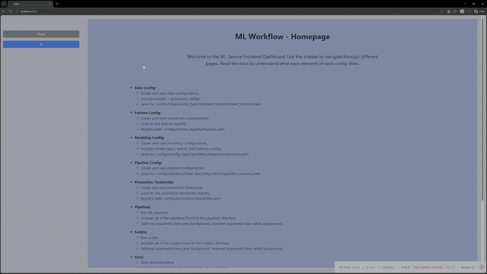
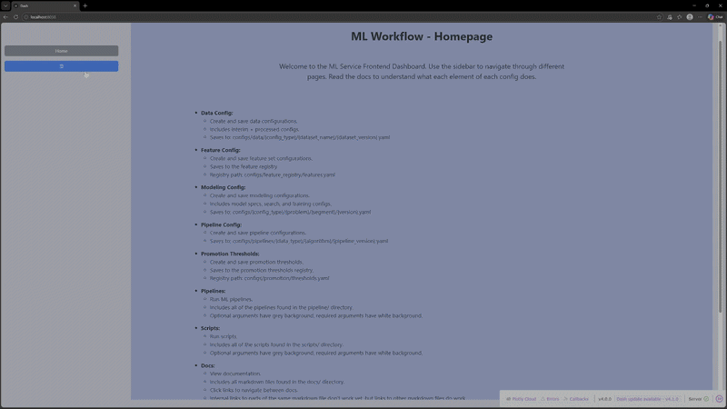
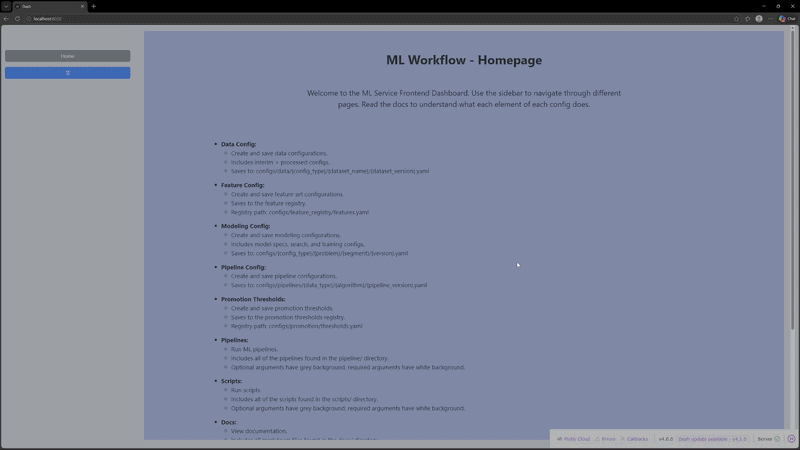
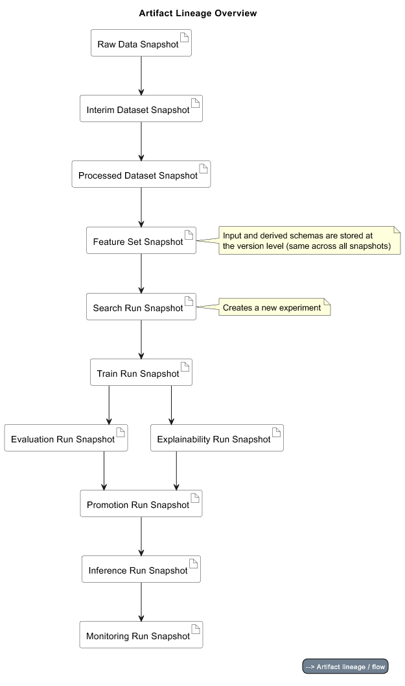

# ML Workflow Engine

## Overview

### A reproducible ML experimentation and model lifecycle system.

- Currently supports the modeling of regression and classification tasks using the CatBoost algorithm.
- Was initially formed based on a hotel_bookings dataset:
    - located in `data/raw/hotel_bookings/v1/2026-02-25T22-43-23_732dfdb7/data.csv`
    - originally from https://www.kaggle.com/datasets/mojtaba142/hotel-booking 
- Current architecture expanded to support many datasets.
- The ml workflow covers everything from the registration of a raw data snapshot to model monitoring.
> Note: The repo was previously named `hotel_management`, so you will see that name around the repo; renamed for clarity 
> on what the project does.

> Another note: A few artifacts are intentionally included, along with their respective logs.
> This enables quick inspection of expected outputs of each pipeline, without having to run anything.

## Features

Pipelines for every part of the ml workflow:
- Data preprocessing
  - Register raw data snapshots
  - Build interim and processed datasets
- Feature (set) freezing
- Hyperparameter search
- Model training
- Model evaluation
- Model explainability
- Model promotion
  - Includes model registry for staging and production
  - Archives past production models
- Model inference
- Model monitoring

Maximum **decoupling** of datasets, feature sets, and modeling
- Datasets merge at runtime, using predefined configs and DAG for ordering
- Feature sets merge at runtime using a predefined entity key
- Models can use any snapshots of datasets and feature sets via snapshot bindings registry
- Validation ensures consistency and predefined minimum row presence

Full **reproducibility**
- Hashing and downstream validation of relevant `artifacts` and `configs`
- Runtime info validation (hardware, git commit, environment...)

Code **quality** ensured by CI, which includes:
- `ruff` checks
- `mypy` checks (moderate strictness)
- import layer checks
- naming conventions checks
- **1235 tests** -> fails if coverage drops below 90%

## Installation

See the [setup guide](docs/setup.md) for installation instructions.

### Brief version

Two options:
- **Docker**
  - requires `docker`
  - operate the workflow through a `browser`
- **Manual use**
  - requires `python` and `conda` (preferably)
  - operate the workflow through a `browser` or `cli + manual (configs)`

## Usage

See the [usage guide](docs/usage.md) for instructions on running the workflow.

### Usage examples (via `ml_service`):

#### Configs Writing, Validation, Saving, and Viewing - Interim Data Configs Example

**Similar functionality exists for other supported configs**

#### Pipeline Running and Artifact Viewing - freeze.py Example

**Similar functionality exists for scripts**

#### Documentation Reading in Browser

#### Directory Structure Viewing in Browser

## Architecture

### Artifact Lineage (high-level overview)

### Details

See the [architecture overview](docs/architecture/overview.md) for details, including:
- Artifact lineage of each pipeline
- Architectural decisions and reasoning
- Validation guarantees
- System invariants
- Boundaries

## Documentation

Full documentation is in [`docs/`](docs/README.md).
It includes:
- Architectural details (mentioned earlier)
- Configuration details (what each config expects)
- Glossary
- Maintenance guidance
- Roadmap
- Setup instructions
- Testing details
- Usage instructions
- API docs (generated with the `pdoc` package)

## Contributing

Please read [`CONTRIBUTING.md`](.github/CONTRIBUTING.md)

## License

This project is licensed under the MIT License. See [LICENSE](LICENSE) for details.

## Author

Sebastijan Dominis

## Contact

sebastijan.dominis99@gmail.com