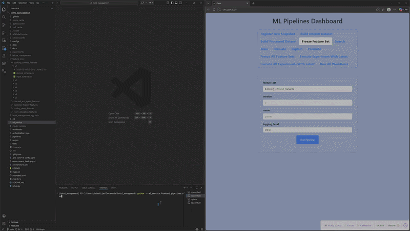
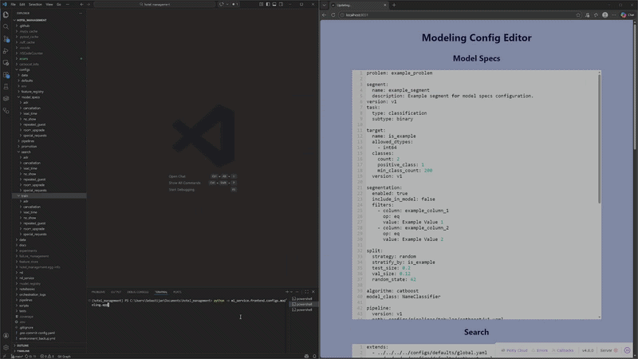
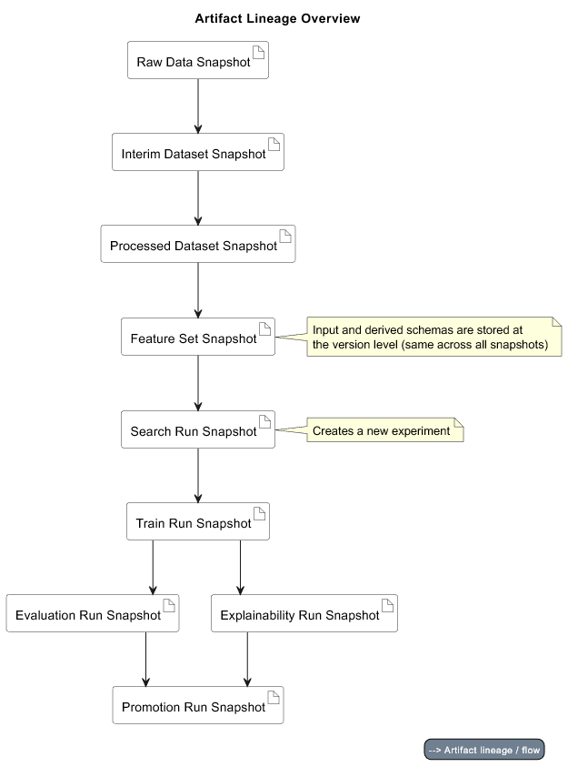
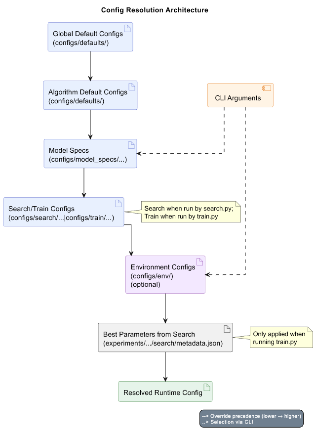

# Hotel Management

## Overview

***A reproducible ML experimentation and model lifecycle system.***

- Currently supports the modeling of regression and classification tasks using the CatBoost algorithm.
- Was initially formed based on a hotel_bookings dataset:
    - located in `data/raw/hotel_bookings/v1/2026-02-25T22-43-23_732dfdb7/data.csv`
    - originally from https://www.kaggle.com/datasets/mojtaba142/hotel-booking 
- Current architecture expanded to support many datasets.
- The ml workflow covers everything from the registration of a raw data snapshot to model promotion.
> Note: the repo was previously named `hotel_management`, so you will see that name; changed for clarity on what the project does

## Features

- Data preprocessing
  - Register raw data snapshots
  - Build interim and processed datasets
- Feature (set) freezing
- Hyperparameter search
- Model training
- Model evaluation
- Model explainability
- Model promotion
  - Includes model registry for staging and production
  - Archives past production models

## Installation

See the [setup guide](docs/setup.md) for installation instructions.

## Usage

See the [usage guide](docs/usage.md) for instructions on running the workflow.

### Examples

**Quick example - training**

1. Run the training pipeline:
```bash
python -m pipelines.runners.train --problem cancellation --segment global --version v1 --env dev --logging-level INFO
```

2. Inspect the produced artifacts in `experiments/cancellation/global/v1/{experiment_id}/training/{train_run_id}/`.
    - Optional: Read the logs found within the same file.

3. Use the artifacts from this run for evaluation and explainability runs.

Note -> this assumes:
- Environment set up properly
- `data/raw/hotel_bookings/v1/{snapshot_id}/data.csv` exists and is uncorrupted (default)
- proper configurations are in place
- previous relevant pipelines have been executed.

**Quick example to try with less setup - raw snapshot registration**

1. Run the pipeline for registering a raw snapshot:
```bash
python -m pipelines.data.register_raw_snapshot --data hotel_bookings --version v1
```

2. Inspect the produced artifact (metadata) in `data/raw/hotel_bookings/v1/{snapshot_id}/metadata.json`
    - Optional: Read the logs found within the same file.

3. Use the artifact from this run for building interim datasets.

Note -> this still assumes:
- Environment set up properly
- `data/raw/hotel_bookings/v1/{snapshot_id}/data.csv` exists and is uncorrupted (default)

### ML Service

Use apps located within `ml_service`, if preferred.
- Dashboard apps written with `Dash` and `FastAPI` as the main packages
- Wrappers for pipelines with friendly UI
- Configuration writing with proper validation

#### Usage examples:

##### Pipelines



##### Modeling Configs



## Architecture

### Artifact Lineage (high-level overview)



### Config Resolution



### Details

See the [architecture overview](docs/architecture/overview.md) for details, including:
- Artifact lineage of each pipeline
- Architectural decisions and reasoning
- Validation guarantees
- System invariants
- Boundaries

## Documentation

Full documentation is in [`docs/`](docs/README.md).
It includes:
- Architectural details (mentioned earlier)
- Configuration details (what each config expects)
- Glossary
- Maintenance guidance
- Roadmap
- Setup instructions
- Testing details
- Usage instructions
- API docs (generated with the `pdoc` package)

## Contributing

Please read [`CONTRIBUTING.md`](.github/CONTRIBUTING.md)

## License

This project is licensed under the MIT License. See [LICENSE](LICENSE) for details.

## Author

Sebastijan Dominis

## Contact

sebastijan.dominis99@gmail.com