# Architecture Overview

This document provides a high-level overview of the system architecture, including artifact lineage, orchestration flow, config resolution, and each of the pipeline scripts (from registering raw data to promotion).

## Main Components
- Pipelines: Orchestration and CLI logic
- ML: Business/domain logic
- Configs: Declarative YAML configuration
- Scripts: Useful scripts (quality assessment, hash generation, etc.)

## Diagrams

### Artifact Lineage (high-level overview)

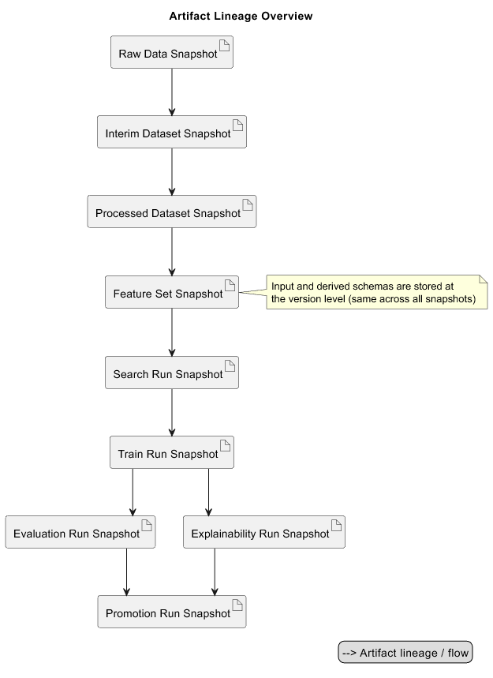

### Orchestration (high-level overview)

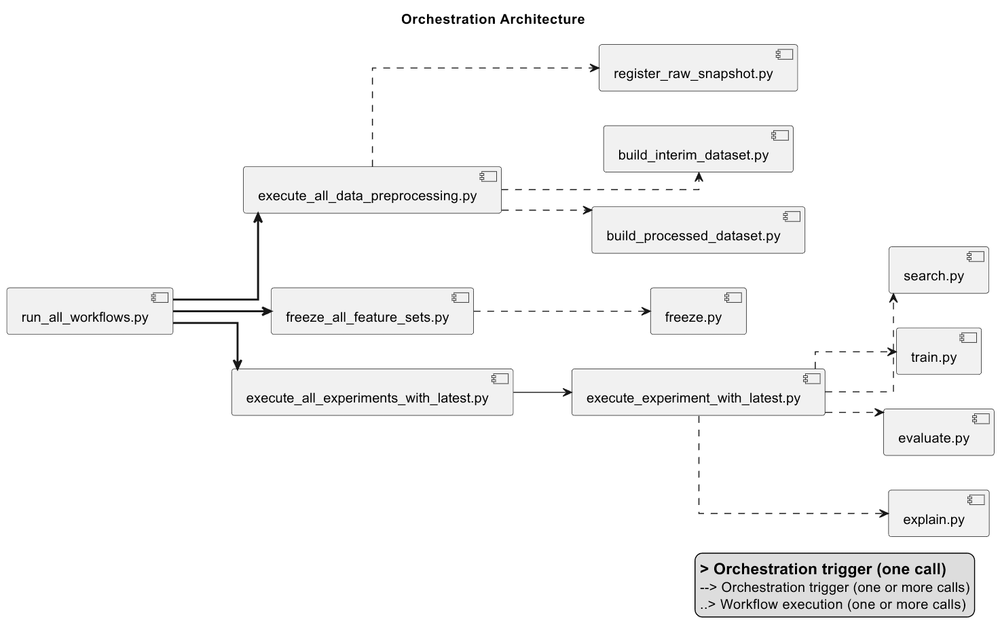

### Config Resolution

- Applicable for search and train

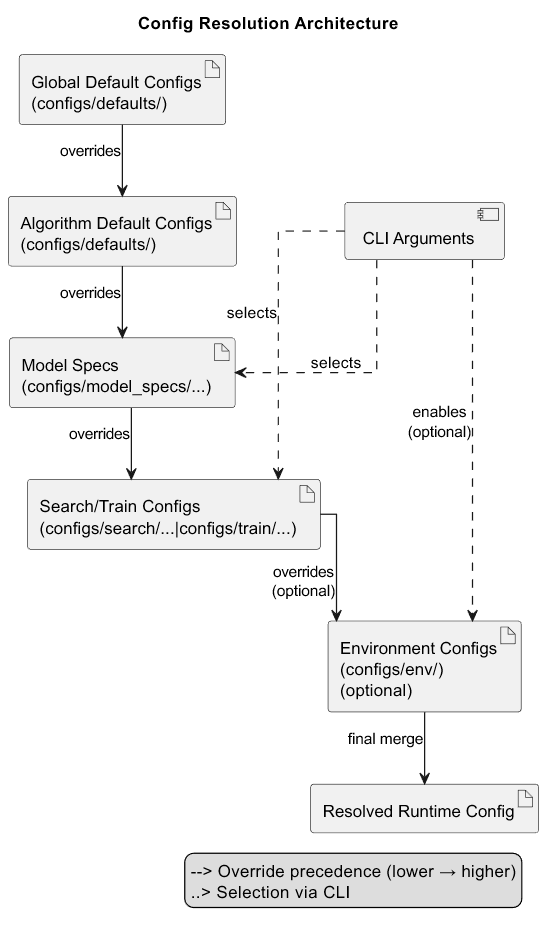

### Data Preprocessing

#### Raw Snapshot Registration

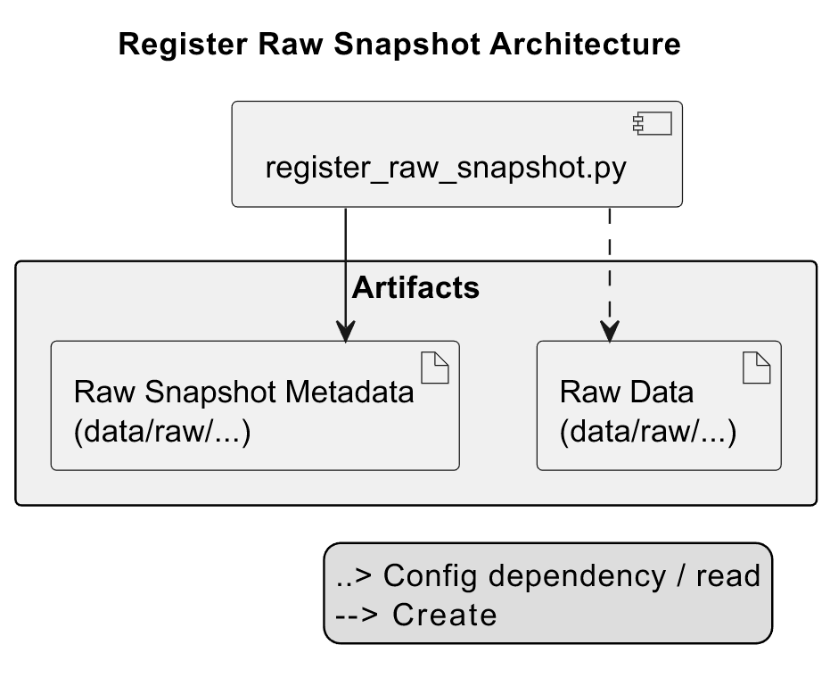

#### Interim Dataset Building

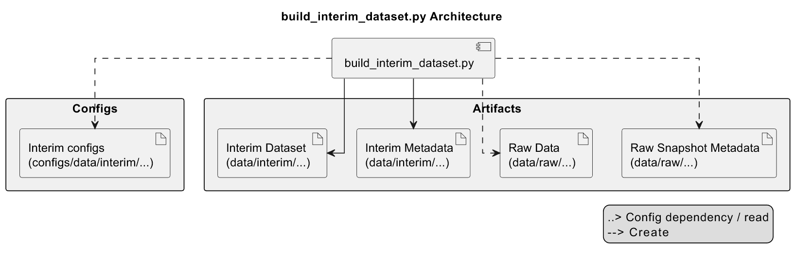

#### Processed Dataset Building

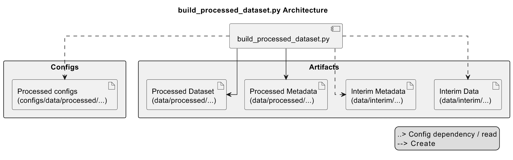

### Feature Freezing

#### Feature Set Freezing

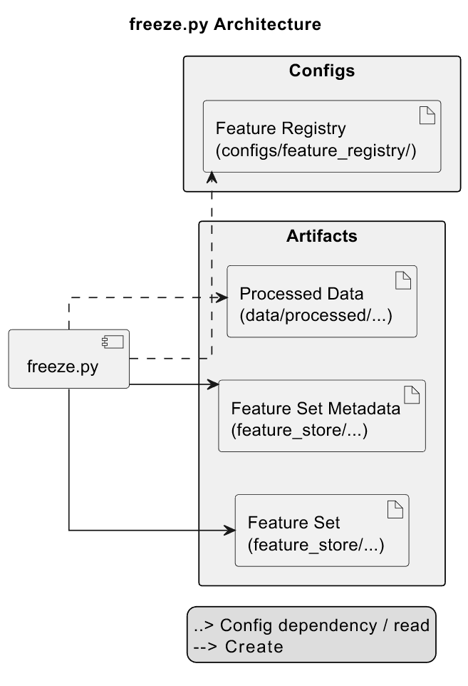

### Search

#### Hyperparameter Search

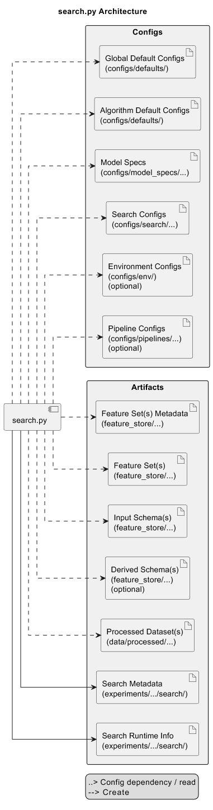

### Runners

#### Training

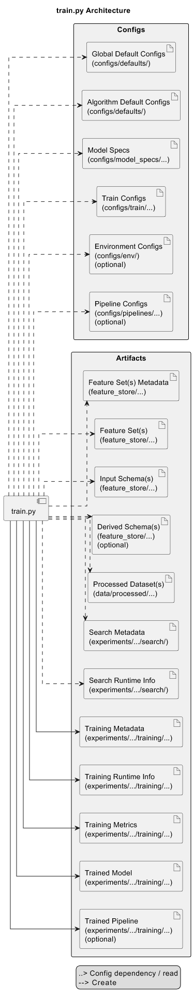

#### Evaluation

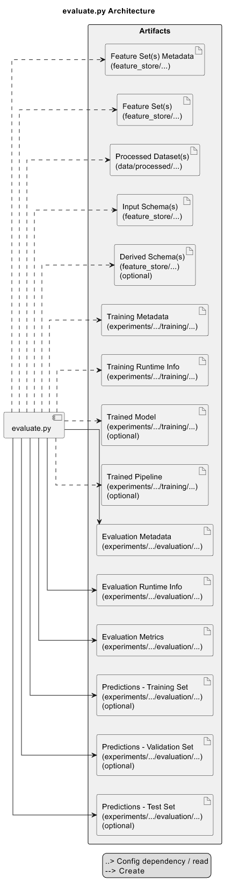

#### Explainability

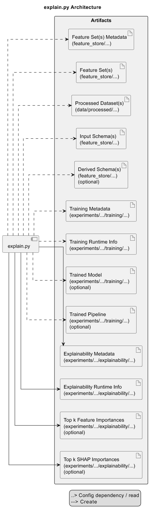

### Promotion

#### Model Staging, Promotion and Archiving

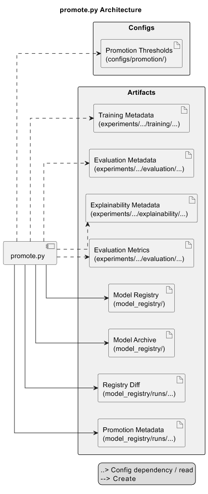

## Design Decisions
- See [decisions.md](decisions.md) for rationale behind architectural choices.
